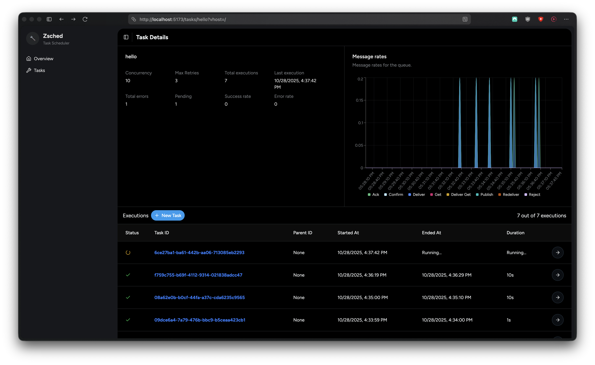

# zsched

[](https://pkg.go.dev/github.com/vlourme/zsched)

A lightweight, opinionated mix of a queue system and task orchestrator built in and for Go, using TimescaleDB and AMQP broker. Designed for simplicity and performance.

> [!CAUTION]
> Until v2 is released, the SDK is not considered stable and breaking changes might happen.



## ✨ Features

- **Queue System**: Built on LavinMQ (AMQP 0.9.1) for reliable message delivery
- **Cron Scheduling**: Dispatch tasks at specific times, with parameters
- **Retry Logic**: Configurable retry mechanisms for handling task failures
- **Concurrency Control**: Fine-grained control over task execution concurrency
- **Persistent Storage**: TimescaleDB integration for storing tasks and execution logs
- **REST API**: Complete HTTP API for task dispatch and log retrieval
- **Web Dashboard**: Clean, lightweight UI for task management and monitoring
- **Hooks**: Execute actions before and after task executions, including **Prometheus** metrics

## 🚀 Quick Start

### Installation

```bash
go get github.com/vlourme/zsched
```

### Basic Usage

1. **Define a task**:

```go
var helloTask = zsched.NewTask(
	"hello",
	func(ctx *zsched.Context[UserCtx]) error {
        time.Sleep(2 * time.Second) // Simulate a long running task

		ctx.Infoln("Hello", ctx.GetStr("name"))

		return nil
	},
	zsched.WithConcurrency(10),
	zsched.WithMaxRetries(3),
	zsched.WithSchedule("* * * * * *", map[string]any{"name": "John"}),
)
```

_Note:_ Schedules might not be respected by the engine, it will dispatch the task and executed when workers are available. This is useful for tasks that might dispatch children tasks.

2. **Create and configure the engine**:

```go
func main() {
    userCtx := UserCtx{} // User context, can be any type

	engine, err := zsched.NewBuilder(userCtx).
		WithRabbitMQBroker(os.Getenv("RABBITMQ_URL")).
		WithTimescaleDBStorage(os.Getenv("POSTGRES_URL")).
		WithHooks(&hooks.PrometheusHook{}, &hooks.TaskLoggerHook{}). // Optional hooks
		WithAPI(":8080").
		Build()
	if err != nil {
		panic(err)
	}

	engine.Register(helloTask)
	engine.Start()
}
```

Check out the [example](example/main.go) for a complete example.

3. **Run your application**:

```bash
go run main.go
```

4. **Dispatch tasks via API**:

```bash
curl -X POST http://localhost:8080/tasks/hello-world \
  -H "Content-Type: application/json" \
  -d '{"name": "John"}'
```

## 📦 Hooks

Hooks are used to execute actions before and after task executions.

### Available Hooks

- `PrometheusHook`: Exposes Prometheus metrics for task execution.
- `TaskLoggerHook`: Logs task executions to the database, required when using the API and Web UI.

## 🐳 Docker support

You will have to dockerize your tasks and the engine, we advice to follow the Dockerfile (`example/Dockerfile`) and docker-compose.yml files to get started.

## 📄 License

This project is licensed under the MIT License - see the [LICENSE](LICENSE) file for details.
